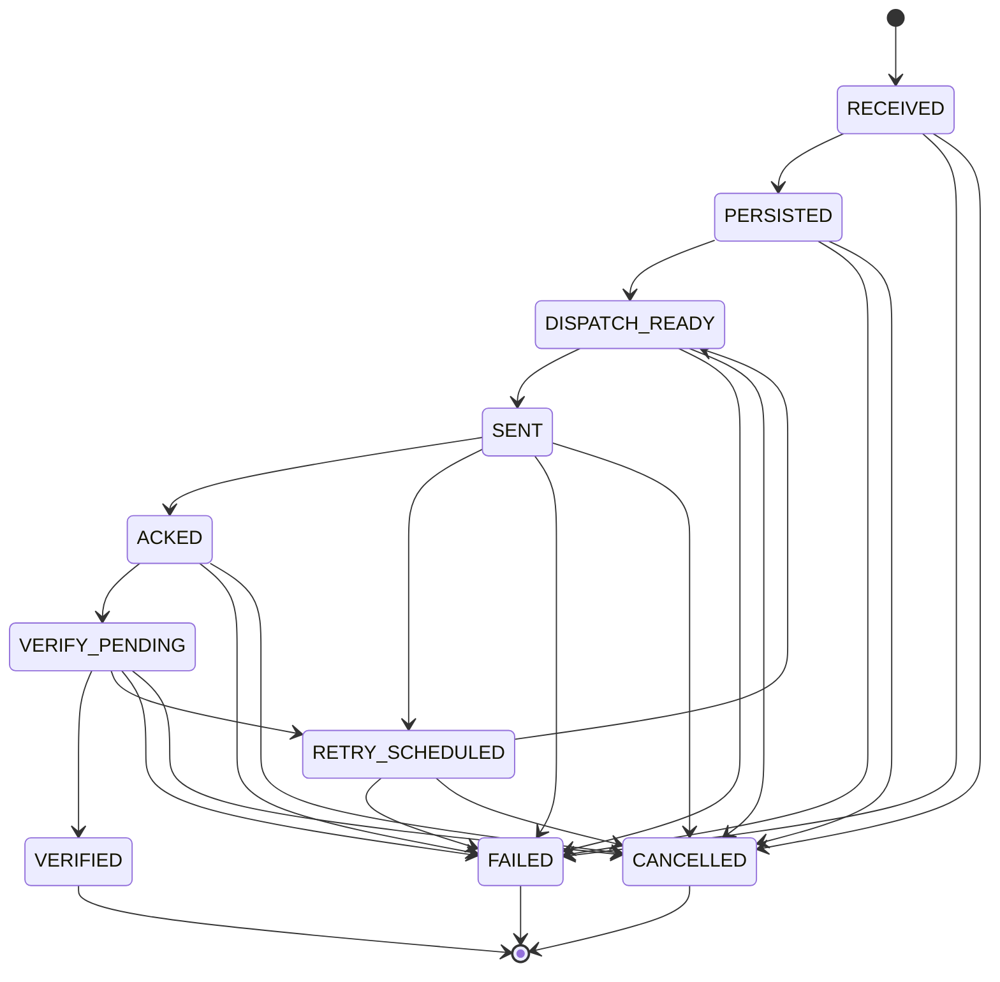

# Domain Lifecycle And Operations

## Purpose

Define the canonical domain model and command lifecycle before implementation details.
This document is the source of truth for SQL schema, MQTT contracts, and interceptor behavior.

## Core Domain Objects

- Intent: A requested desired state change from JMRI or other upstream systems.
- Command: A transport-ready actuation request derived from an intent.
- CommandAttempt: A single send attempt for a command.
- Device: A controllable field element (turnout, signal, and future device classes).
- DeviceState: Latest known desired and actual state for a device.
- CommandEvent: Audit event for state transitions and failures.

## Identity And Correlation

- intentId: Unique id for an intent record.
- correlationId: Groups related commands/events for one user/system action.
- commandId: Unique id for each command, used for dedupe and stale-response protection.
- nodeId: Hardware node address for RS485 dispatch.
- deviceId: Logical device id (for example turnout-12, signal-A1).

## Command Lifecycle

State set for commandStatus:

1. RECEIVED: Intent accepted and validated.
2. PERSISTED: Intent and initial command row stored.
3. DISPATCH_READY: Ready for transport send.
4. SENT: Frame sent to RS485/MQTT layer.
5. ACKED: Target node acknowledged commandId.
6. VERIFY_PENDING: Settle delay active before polling actual state.
7. VERIFIED: Actual state matches desired state.
8. RETRY_SCHEDULED: Reconciliation failed, another attempt planned.
9. FAILED: Attempts exhausted or terminal error.
10. CANCELLED: Superseded by a newer intent for same device.

Allowed transitions:

- RECEIVED -> PERSISTED
- PERSISTED -> DISPATCH_READY
- DISPATCH_READY -> SENT
- SENT -> ACKED
- SENT -> RETRY_SCHEDULED
- ACKED -> VERIFY_PENDING
- VERIFY_PENDING -> VERIFIED
- VERIFY_PENDING -> RETRY_SCHEDULED
- RETRY_SCHEDULED -> DISPATCH_READY
- Any non-terminal state -> FAILED
- Any non-terminal state -> CANCELLED

## CommandStatus State Diagram

Rendered diagram image:

## Reconciliation Policy Baseline

- Max retries: configurable per operation type.
- Backoff: exponential with jitter.
- Verification delay: configurable settleDelayMs before first poll.
- Terminal failure: store failureReason and attempt history.

## Operations Catalog (Initial)

### Common Fields For All Operations

- commandId
- correlationId
- operationType
- deviceType
- deviceId
- nodeId
- desiredState
- requestedAt
- ttlMs (optional)
- priority (optional)
- metadata (optional map)

### Turnout Operations

- Operation type: TURNOUT_SET
- Desired state values: OPEN, CLOSED
- Device behavior: binary throw
- Typical verification: readback position switch or node-reported state

### Signal Operations

- Operation type: SIGNAL_SET
- Desired state values: STOP, APPROACH, CLEAR, RESTRICTED (configurable)
- Device behavior: multi-aspect state machine
- Typical verification: node-reported current aspect

## Commonalities And Differences

Common:

- All operations are idempotent by commandId.
- All operations need desired and actual state reconciliation.
- All operations produce lifecycle and audit events.

Differences:

- State cardinality differs (binary turnout vs multi-aspect signal).
- Settle delay and retry profile may differ by operation type.
- Validation rules differ (allowed states per device profile).

## Design Constraints

- Store-before-send for auditability and recovery.
- At-least-once delivery with idempotent actuation.
- Deterministic terminal states (VERIFIED, FAILED, CANCELLED).
